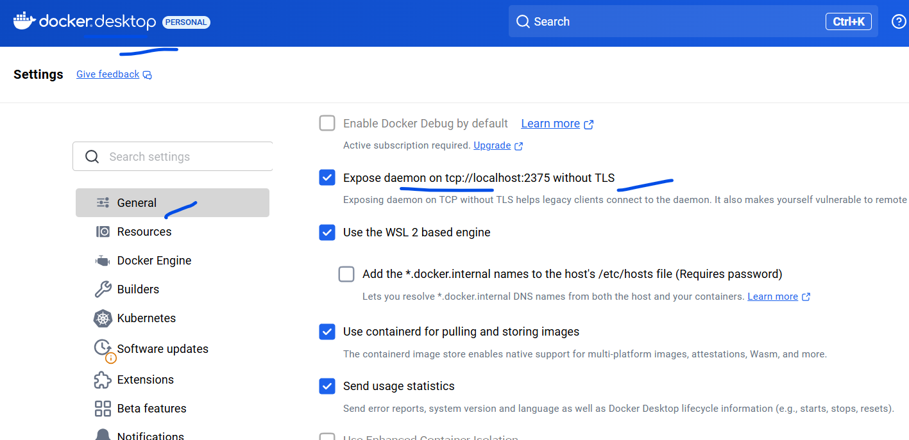

# 🧪 Jenkins Pipeline Lab: End-to-End with Docker

---

## **1. Prerequisites**

Ensure the following are installed and configured:

* **OS**: Linux VM (Ubuntu/Rocky Linux) or Windows with WSL2
* **Java (11 or 17)** → required for Jenkins
* **Jenkins** → installed and running on `http://<IP>:8080`
* **Git** → installed (`git --version`)
* **Docker** → installed and running (`docker ps`)
* **DockerHub account** → for pushing images
* **Plugins in Jenkins**:

  * Git Plugin
  * Pipeline Plugin
  * Docker Pipeline Plugin
  * Blue Ocean (optional for visualization)

---

## **2. GitHub Repository Setup**

Create a GitHub repo named `jenkins-docker-lab` with the following structure:

```
jenkins-docker-lab/
│── Dockerfile
│── app.py
│── requirements.txt
│── Jenkinsfile
```

**app.py** (simple Python Flask app):

```python
from flask import Flask
app = Flask(__name__)

@app.route('/')
def hello():
    return "Hello from Jenkins-Docker Pipeline!"

if __name__ == "__main__":
    app.run(host="0.0.0.0", port=5000)
```

**requirements.txt**:

```
flask==2.2.5
```

**Dockerfile**:

```dockerfile
FROM python:3.9-slim
WORKDIR /app
COPY requirements.txt .
RUN pip install -r requirements.txt
COPY . .
CMD ["python", "app.py"]
```

---

## **3. Jenkins Pipeline (Jenkinsfile)**

```groovy
pipeline {
    agent any

    environment {
        DOCKERHUB_USER = 'your-dockerhub-username'
        DOCKERHUB_cred = credentials('dockerhub-cred') // Jenkins Credential ID
        IMAGE_NAME = 'jenkins-docker-lab'
    }

    stages {
        stage('Checkout Code') {
            steps {
                git branch: 'main',
                    url: 'https://github.com/your-username/jenkins-docker-lab.git', credentialsId: 'your-jenkins-credential-id-for-github'
            }
        }
        stage('Clean up image and container') {
            steps {
                script {
                    sh 'docker rm  jenkins_app -f || true'
                    sh 'docker image rmi $DOCKERHUB_USER/$IMAGE_NAME:latest || true' 
                }
            }              
        stage('Build Docker Image') {
            steps {
                script {
                    sh 'docker build -t $DOCKERHUB_USER/$IMAGE_NAME:latest .'
                }
            }
        }
        stage('Push to DockerHub') {
            steps {
                script {
                    sh "echo $DOCKERHUB_cred_PSW | docker login -u $DOCKERHUB_USER --password-stdin"
                    sh 'docker push $DOCKERHUB_USER/$IMAGE_NAME:latest'
                }
            }
        }

        stage('Deploy (Run Container)') {
            steps {
                script {
                    sh 'docker run -d -p 5000:5000 --name jenkins_app $DOCKERHUB_USER/$IMAGE_NAME:latest'
                }
            }
        }
    }

    post {
        always {
            sh 'docker ps -a'
        }
        success {
            echo "✅ Pipeline completed successfully!"
        }
        failure {
            echo "❌ Pipeline failed!"
        }
    }
}
```

For error as below in the jenkins pipeline
```
[Pipeline] }
[Pipeline] // stage
[Pipeline] stage
[Pipeline] { (Build Docker Image)
[Pipeline] script
[Pipeline] {
[Pipeline] sh
+ docker build -t vishwacloudlab/jenkins-docker-lab:latest .
ERROR: Cannot connect to the Docker daemon at unix:///var/run/docker.sock. Is the docker daemon running?
```


Re-Create jenkins with below for linux machine
```
docker run -d --name jenkins -p 8500:8080 -p 50000:50000 -v jenkins_home:/var/jenkins_home -v /var/run/docker.sock:/var/run/docker.sock  vishwacloudlab/jenkins:v1

```
* The above image has already pre-installed , git, docker manully . 
* Please make to enable the below option on docker desktop



* for windows docker desktop 
```
docker run -d --name jenkins -p 8500:8080 -p 50000:50000 -v jenkins_home:/var/jenkins_home -e DOCKER_HOST=tcp://host.docker.internal:2375  vishwacloudlab/jenkins:v1
```


---

## **4. Jenkins Configuration**

1. **Install Docker inside Jenkins server**

   ```bash
   sudo apt-get update -y
   sudo apt-get install docker.io -y
   sudo usermod -aG docker jenkins
   sudo systemctl restart jenkins
   ```

2. **Add DockerHub Credentials in Jenkins**

   * Go to Jenkins → `Manage Jenkins` → `Credentials` → `Add Credentials`
   * Type: Username/Password
   * ID: `dockerhub-cred`

3. **Create Pipeline Job**

   * New Item → Pipeline → Name: `jenkins-docker-lab`
   * Definition: Pipeline script from SCM → GitHub Repo URL

---

## **5. Run the Pipeline**

* Trigger the job in Jenkins
* Watch stages:

  1. Checkout Code
  2. Build Docker Image
  3. Run Unit Tests
  4. Push to DockerHub
  5. Deploy (run locally on port 5000)

---

## **6. Validation**

* After successful run, test app:

  ```bash
  curl http://localhost:5000
  ```

  Response → `Hello from Jenkins-Docker Pipeline!`

* Check DockerHub for pushed image:
  `docker pull <dockerhub-user>/jenkins-docker-lab:latest`

---

## **7. Cleanup**

```bash
docker stop jenkins_app
docker rm jenkins_app
docker rmi <dockerhub-user>/jenkins-docker-lab:latest
```

---

✅ This lab gives your students **hands-on CI/CD** with **Jenkins + Docker + GitHub + DockerHub**, covering all dependencies.
