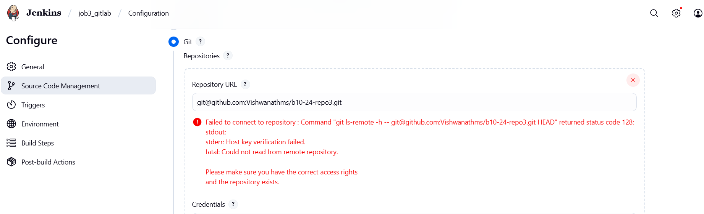
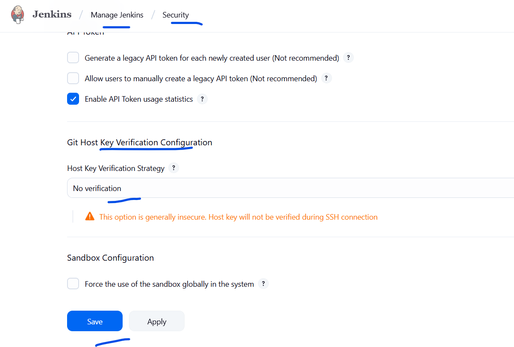
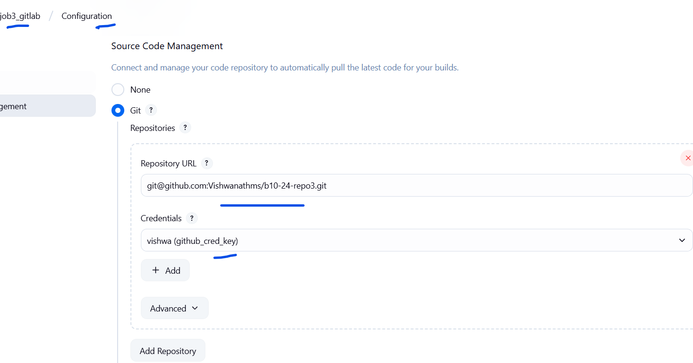

## Observation

* Below error is seen on the container jenkins



This is because the ".ssh" folder is missing on the  jenkins home folder.

```
root@9f49f3261540:/# ls -la /var/jenkins_home/
total 132
drwxr-xr-x 15 jenkins jenkins  4096 Sep  3 10:03 .
drwxr-xr-x  1 root    root     4096 Aug 20 16:08 ..
-rw-------  1 jenkins jenkins   132 Sep  3 10:03 .bash_history
drwxr-xr-x  3 jenkins jenkins  4096 Sep  2 05:57 .cache
drwxr-xr-x  3 jenkins jenkins  4096 Sep  2 06:07 .groovy
drwxr-xr-x  3 jenkins jenkins  4096 Sep  2 05:57 .java
-rw-r--r--  1 jenkins jenkins     0 Sep  3 04:50 .lastStarted
-rw-r--r--  1 jenkins jenkins     1 Sep  3 09:07 .owner
-rw-r--r--  1 jenkins jenkins  1663 Sep  3 04:50 config.xml
```

## Solution
manually to create the .ssh folder and provide jenkins permission inside the jenkins container 
```
root@9f49f3261540:/# mkdir -p /var/jenkins_home/.ssh
root@9f49f3261540:/# chown -R jenkins:jenkins /var/jenkins_home/.ssh
root@9f49f3261540:/# ls -la /var/jenkins_home/ | grep .ssh
drwxr-xr-x  2 jenkins jenkins  4096 Sep  3 10:09 .ssh
root@9f49f3261540:/#
```



