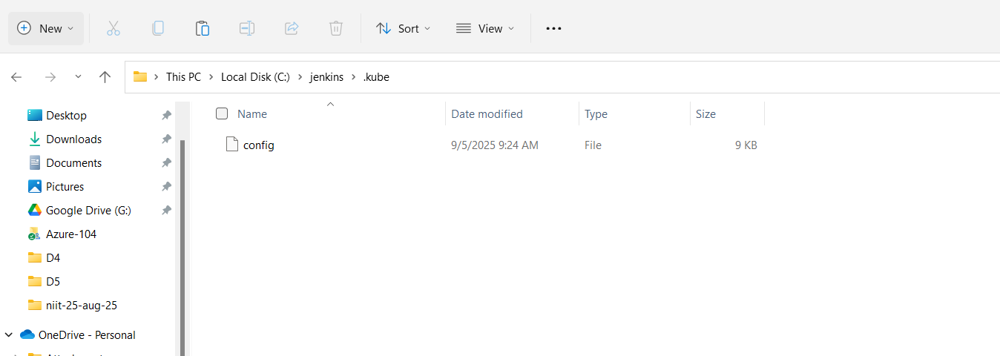

## access docker desktop kubernetes on jenkins 

* since the config file on windows, we have to map that to the jenkins container 


# Step1
* Test the kubernets access
```
kubectl config get-contexts
kubectl config use-context docker-desktop
```
* verify
```
C:\Users\ADMIN>kubectl get pods
No resources found in default namespace.
```

# Step2
*  -- we will copy the C:\Users\ADMIN\.kube to seperate location for jenkins container access


Delete the jenkins and map the above volume as well
```
docker rm jenkins -f
```
```
docker run -d --name jenkins -p 8500:8080 -p 50000:50000 --user root -v jenkins_home:/var/jenkins_home -e DOCKER_HOST=tcp://host.docker.internal:2375 -v C:/jenkins/.kube:/home/jenkins/.kube vishwacloudlab/jenkins:v2
```
* Login to container
```
docker exec -it -u root jenkins /bin/bash      
    export KUBECONFIG=/home/jenkins/.kube/config
    kubectl config get-contexts
    kubectl config use-context docker-desktop
```


